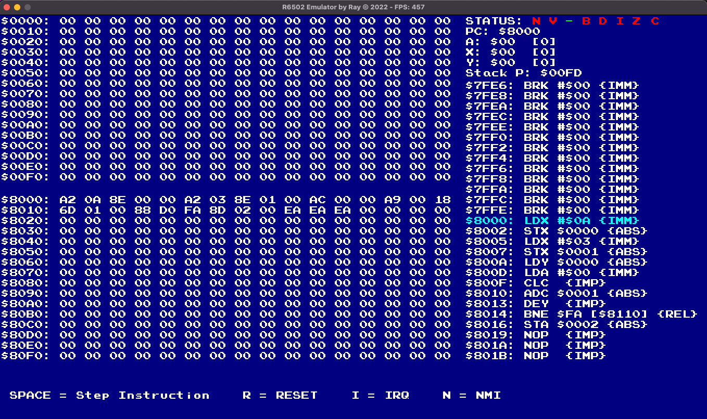

# R6502 Implementation
An implementation of the R6502 microprocessor. 
The aim is to learn more about micro-architecture and assembly while taking a crack at trying to behaviorally emualate the 6502.

# Resources used 
- [R650X and R651X Microprocessors (CPU) Datasheet](http://archive.6502.org/datasheets/rockwell_r650x_r651x.pdf)
- [W65C02S 8–bit Microprocessor Datasheet](https://eater.net/datasheets/w65c02s.pdf)

